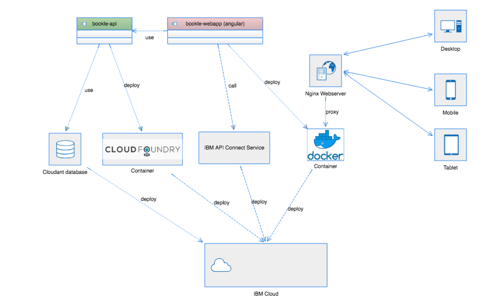
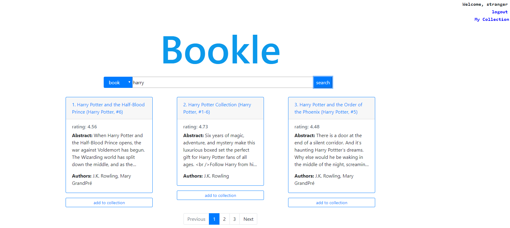

# [Bookle](https://bookle.eu-de.mybluemix.net)
- The purpose of the project is to develop an online book searching and sharing system.
- The book data is crawled from [Goodreads](https://www.goodreads.com/)
- Deployed on [IBM Cloud](https://www.ibm.com/cloud)
- Back-end: [Node.js](https://nodejs.org/en/) ([Loopback framework](https://loopback.io/)); RESTful APIs; [Cloudant database](https://www.ibm.com/cloud/cloudant)
- Front-end: [Angular](https://angular.io/); [Bootstrap](https://getbootstrap.com/)

## Framework


## Deploy on IBM cloud

- https://bookle.eu-de.mybluemix.net
- the link above may not work, because IBM only 6 months free for student account
- use `deploy2` on IBM cloud
- PS: There are some bugs on IBM cloud, such as refreshing to 404 error, because of the different build environment between IBM cloud and local. However, you can still use the local running model without bugs.

## Description
### branch
- running on the local: `master` branch
- running on cloud: `deploy2` branch
### files
- data-preprocess: getting books and authors data from Goodreads
- bookle-api: backing service based on Loopback + Cloudant
- bookle-webapp: fronting service based on Angular

## Run in the local
0. use `master` branch
1. run `npm install` in `./bookle-api` and `./bookle-webapp`
2. set `apiEndpoint` and `auth` in ` ./bookle/bookle-webapp/src/environmentsenvironment.ts`
3. start loopback locally in `./bookle-api`
4. start angular application: run `ng serve` in `./bookle-webapp`

## LoopBack API on IBM cloud
```
  apiEndpoint: 'https://bookle-vu.eu-de.cf.appdomain.cloud/api',
  auth: {
    clientId: '483ce3cd-4a9b-4a42-b8c0-21c7b63813be',
    clientSecret: 'fB1gU2hD3gN6dB8nK4bJ3xU7wX8fM6fR6sE3bI7hN0iS0sK6iE'
    }
```

## Login
### Customer
You can try to use this or register a new account:
- username: aa@aa.com
- password: 123456
### Admin
You can try to use this:
- username: admin@admin.com
- password: admin

## Search
### book
You can try to search: `harry`
### author
You can try to search: `Rowling`
